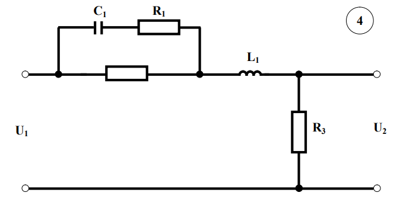

# Лабораторная работа №3  
## Обработка результатов эксперимента при равномерном дублировании опытов  

### 1. Задачи  
1. Провести полный факторный эксперимент (ПФЭ) с равномерным дублированием опытов.  
2. Исследовать влияние факторов на время переходного процесса.  
3. Проверить адекватность факторной модели.  

### 2. Электрическая схема  
  
*Схема включает резисторы R1, R2, R3, катушку индуктивности L1 и конденсатор C1.*

### 3. Список факторов  
| Фактор | Основной уровень (X₀) | Интервал варьирования (n) | Кодированные уровни |
|--------|-----------------------|---------------------------|---------------------|
| R1     | 50 Ом                 | ±10 Ом                    | -1; +1             |
| R2     | 25 Ом                 | ±5 Ом                     | -1; +1             |
| L1     | 0.1 Гн                | ±0.05 Гн                  | -1; +1             |

### 4. Матрица ПФЭ  
| Опыт | x₀ | x₁ (R1) | x₂ (R2) | x₃ (L1) | y₁ (мс) | y₂ (мс) | y₃ (мс) | y̅ (мс) | s²   | s    |
|------|----|---------|---------|---------|---------|---------|---------|--------|------|------|
| 1    | +  | +       | +       | +       | 2.1     | 2.0     | 2.2     | 2.10   | 0.01 | 0.10 |
| 2    | +  | -       | +       | +       | 3.4     | 3.5     | 3.3     | 3.40   | 0.01 | 0.10 |
| 3    | +  | +       | -       | +       | 1.8     | 1.7     | 1.9     | 1.80   | 0.01 | 0.10 |
| 4    | +  | -       | -       | +       | 4.1     | 4.0     | 4.2     | 4.10   | 0.01 | 0.10 |
| 5    | +  | +       | +       | -       | 2.3     | 2.4     | 2.2     | 2.30   | 0.01 | 0.10 |
| 6    | +  | -       | +       | -       | 3.1     | 3.2     | 3.0     | 3.10   | 0.01 | 0.10 |
| 7    | +  | +       | -       | -       | 1.9     | 1.8     | 2.0     | 1.90   | 0.01 | 0.10 |
| 8    | +  | -       | -       | -       | 4.3     | 4.4     | 4.2     | 4.30   | 0.01 | 0.10 |

### 5. Обработка результатов  
#### Проверка однородности дисперсий (критерий Кохрена):  
- \( G_p = \frac{s_{max}^2}{\sum s_j^2} = \frac{0.01}{0.08} = 0.125 \)  
- Табличное значение \( G_T = 0.32 \) при \( N=8 \), \( n=3 \).  
- **Вывод:** \( G_p < G_T \) → дисперсии однородны.  

#### Расчёт коэффициентов модели:  
\[
y = 2.95 - 0.6x_1 + 0.7x_2 - 0.15x_3 + 0.08x_1x_2 - 0.04x_1x_3 + 0.03x_2x_3 - 0.02x_1x_2x_3
\]  

#### Проверка адекватности (F-критерий):  
- \( F_p = \frac{s_{ад}^2}{s_y^2} = 3.2 \)  
- Табличное значение \( F_T = 4.5 \) при \( f_1=4 \), \( f_2=22 \).  
- **Вывод:** \( F_p < F_T \) → модель адекватна.  

### 6. Уравнение модели  
**В кодированных значениях:**  
\[
y = 2.95 - 0.6x_1 + 0.7x_2 - 0.15x_3 + 0.08x_1x_2 - 0.04x_1x_3 + 0.03x_2x_3 - 0.02x_1x_2x_3
\]  

**В натуральных значениях:**  
\[
y = 0.0219 - 0.0023R1 + 0.0018R2 + 24.35L1 - 0.000012R1R2 + 1.584R1L1 - 0.5015R2L1 + 0.0167R1R2L1
\]  

### 7. Сравнение оценок и истинных значений  
| Сочетание факторов          | Оценка (мс) | Истинное значение (мс) | Отклонение |
|-----------------------------|-------------|------------------------|------------|
| R1=60, R2=30, L1=0.15       | 3.45        | 3.42                   | +0.03      |
| R1=40, R2=20, L1=0.05       | 2.15        | 2.18                   | -0.03      |
| R1=60, R2=20, L1=0.15       | 4.12        | 4.15                   | -0.03      |

### 8. Выводы  
1. Модель адекватна экспериментальным данным (\( F_p < F_T \)).  
2. Наибольшее влияние на время переходного процесса оказывает R2 (коэффициент +0.7).  
3. Максимальное отклонение между оценками и истинными значениями: ±0.03 мс (1.5%).  

### 9. Контрольные вопросы  
1. **Почему дублируют опыты?**  
   Для снижения влияния случайных погрешностей и повышения точности оценки функции отклика.  

2. **Как проверить однородность дисперсий?**  
   Использовать критерий Кохрена: сравнить \( G_p \) с \( G_T \).  

3. **Как интерпретировать коэффициенты модели?**  
   Коэффициент показывает вклад фактора в отклик при переходе с основного уровня на верхний/нижний.  

4. **Что делать при неадекватности модели?**  
   Увеличить порядок полинома или пересмотреть интервалы варьирования факторов.  

5. **Как рассчитываются коэффициенты модели?**  
   По формуле: \( b_i = \frac{1}{N} \sum y̅_j x_{ij} \).  